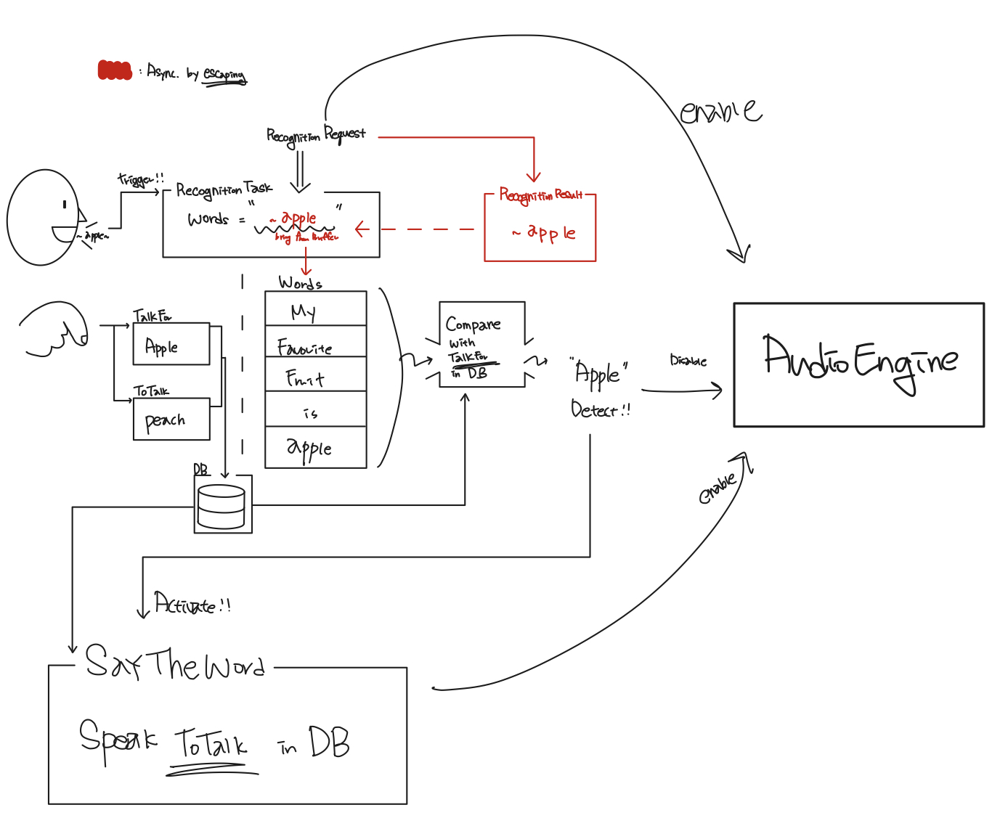

# RevengeUrVoice
iOS App. using Swift
(available upper iOS 10.0)

# 1. Introduction
## 1.1 Purpose
우리는 종종 친구나 연인과 대화하다 보면 듣기 싫은 말들을 들을 때가 있다.  
**비속어**를 쓴다던지, **관심없는 주제**에 관련해 듣는다던지, 정말 **불리기 싫은 별명**을 불릴 때라던지 말이다.   
본인은 그런 상황을 겪을 때마다 만류도 하고 비판도 하는 등의 힘겨운 저항을 해왔지만, 이러한 힘겨운 노력들을 이제는 자동화하고자 한다.   

> 은혜는 반으로, 복수는 두배로!  
 
위의 구절을 가슴속에 되새기며 자동화 개발을 진행하였다.  

## 1.2 Outline
동작의 기본 구성은 간단하다.  

> (내가 듣기 싫은) 특정 단어를 감지하면, (상대방이 듣기 싫은) 특정 단어를 들려준다  
 
이열치열의 전략을 사용하는 것이다 :)  
앱을 구성하기 위해 필요한 것들은 아래와 같다.   

1. 사용자의 기본 언어 (Korean/English)
2. (내가 듣기 싫은) 구별할 특정 단어
3. (상대방이 듣기 싫은) 자동으로 내뱉을 특정 단어
4. 구별할 단어를 저장할 DB 

---
아래는 작업 전 작성해본 Outline 이다   

  

고려되어야 할 가장 중요한 부분은 음성 Input이 들어갈 때, Recognition Request의 Result 가 words 에 추가되는 시점이 **@escaping** 으로 인해 Async 라는 점이며, 사용자의 음성을 듣는 AudioEngine과 특정 단어을 자동으로 내뱉는 AudioEngine이 동일하다는 점이다.   
따라서 Async로 들어오는 Request의 Result를 받을 시점을 잘 파악하고 해당 시점에 알맞게 AudioEngine을 끄고 특정 단어를 내뱉은 후 다시 AudioEngine을 켜는 등의 스케쥴링 조율이 필요하다.
 

# 2. StoryBoard
## 2.1 Input

  

> 메롱 바보 해삼 멍게 

## 2.2 Output

